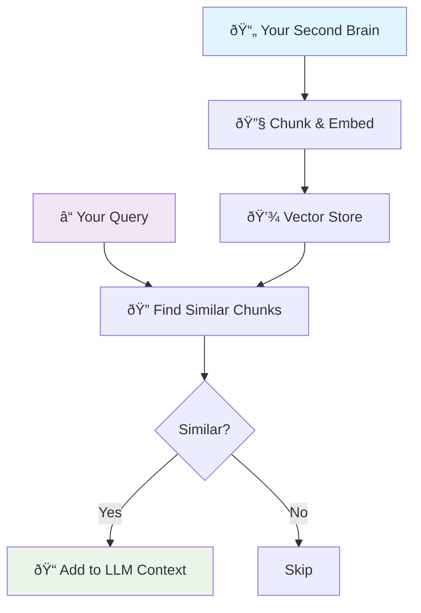

# Brain MCP Server

**Semantic knowledge base access for markdown notes via Model Context Protocol**

Brain adds large directories of notes (such as Obsidian vaults), emails, or individual files (such as PDF's) into an intelligent, searchable knowledge base that integrates with Claude Code and other agentic frameworks via MCP.

## 🧠 How Brain Works



Brain reads your markdown files (such as Obsidian vaults), PDF's, etc and creates semantic embeddings, and provides intelligent search through MCP tools. Ask Claude Code naturally: "Using my meeting notes from the REACH collaboration and the hexagonal antenna array PDFs, help me understand the chromatic distortion mitigation strategy for the 50-200 MHz band" and it automatically searches your notes and returns adds only **relevant** notes to the context window. Brain automatically determines which notes are relevant and if no notes are relevant nothing is added to the context.

## 🚀 Install

### 1. Install Brain
```bash
sudo npm install -g brain-mcp
```

### 2. Setup Configuration
```bash
brain setup
```
This will ask for your notes directory and OpenAI API key.

### 3. Add to Claude Code
After running `brain setup`, add Brain to Claude Code:

```bash
claude mcp add brain node "$(npm root -g)/brain-mcp/dist/mcp/server.js" -s user
```

This installs Brain globally for all your Claude Code projects. Learn more about [Claude MCP configuration](https://docs.anthropic.com/en/docs/claude-code/mcp-servers).

### 4. Add to Other Agentic Frameworks
Brain is a standard MCP server. For other MCP-compatible systems, use:
- **Command**: `brain-mcp`  
- **Args**: `["server"]`
- **Protocol**: Model Context Protocol v1.0

The server runs on stdio and is compatible with any MCP client or agentic framework.

## 🔧 Manual Commands

```bash
# Interactive setup (notes path, API key, MCP config)
brain setup

# Update search index for changed files
brain update

# Rebuild entire search index  
brain clear

# Show configuration and status
brain status
```

## 🎯 Usage

Once installed, Brain provides these MCP tools:
- **brain_search** - Semantic search across your notes
- **brain_read** - Read specific notes with context
- **brain_overview** - Knowledge base summary
- **brain_related** - Find connected notes
- **brain_list** - Browse notes by directory

Simply ask Claude Code questions about your notes and it will automatically use these tools.

## 5. Example Interaction

Here's what a typical interaction with Claude Code looks like once Brain is installed:

```
You: Using my notes from the REACH team meeting and the bayesian analysis PDF, can you explain how we're handling the foreground wedge contamination in our 21-cm signal extraction?

Claude: I'll search your notes for information about REACH's foreground wedge and Bayesian analysis approach.

<function_calls>
<invoke name="mcp__brain__brain_search">
<parameter name="query">REACH foreground wedge bayesian 21-cm signal</parameter>
</invoke>
</function_calls>

<function_results>
Found 4 relevant chunks:
- meetings/2024-reach-collaboration.md (similarity: 0.93)
- pdfs/reach-bayesian-pipeline.pdf (similarity: 0.89)
- reach-antenna-design.md (similarity: 0.76)
- cosmic-dawn-theory.md (similarity: 0.72)
</function_results>

Let me read the most relevant meeting notes:

<function_calls>
<invoke name="mcp__brain__brain_read">
<parameter name="notePath">meetings/2024-reach-collaboration.md</parameter>
</invoke>
</function_calls>

Based on your REACH collaboration notes and the Bayesian pipeline PDF, you're using a Bayesian framework to separate the 21-cm signal from foregrounds. The meeting notes highlight that the hexagonal array's chromatic response is key - by having well-characterised frequency-dependent beam patterns, you can distinguish between spectrally smooth foregrounds (confined to the wedge) and the structured 21-cm signal.

The PDF details how the pipeline uses physically motivated foreground models with 5-7 log-polynomial terms, while simultaneously fitting for the 21-cm signal using turning points at z~17 (absorption trough) and z~6 (emission peak). Your notes mention achieving 100-200 mK sensitivity in the 50-200 MHz band after 1000 hours of integration.
```

**Note**: While Brain automatically searches when relevant, at this stage we recommend occasionally hinting to Claude that it should "look in your notes" or "search my knowledge base" for optimal results, as full automatic detection is still being optimized.

## 🚧 Roadmap

- [x] Parallel semantic search
- [x] Status CLI commands
- [x] Auto initialization
- [ ] Multiple vaults support
- [ ] Accept other sources (email, todo lists, etc.)
- [ ] Include other file types (images, PDFs)
- [ ] Add open source embedding models
- [ ] Add to brain?

## 📋 Requirements

- Node.js 16+
- OpenAI API key (for embeddings)
- Markdown notes directory (e.g., Obsidian vault)
- MCP-compatible client (Claude Code, etc.)
