# Brain MCP Server

**Semantic knowledge base access for your markdown notes via Model Context Protocol**

Brain transforms your markdown notes into an intelligent, searchable knowledge base that integrates with Claude Desktop and other MCP-compatible systems.

## 🧠 Overview

```mermaid
flowchart LR
    A[📄 Your Notes] --> B[🔧 Brain MCP]
    B --> C[🤖 Claude Desktop]
    B --> D[🔗 Other MCP Clients]
    
    style A fill:#e1f5fe
    style B fill:#f3e5f5
    style C fill:#e8f5e8
    style D fill:#e8f5e8
```



Brain reads your markdown files, creates semantic embeddings, and provides intelligent search through MCP tools. Ask Claude naturally: "What did I learn about React?" and it automatically searches your notes.

## 🚀 Install

### 1. Install Brain
```bash
npm install -g brain-mcp
```

### 2. Setup Configuration
```bash
brain setup
```
This will ask for your notes directory and OpenAI API key.

### 3. Add to Claude Desktop
Add this to your Claude Desktop MCP configuration:

```json
{
  "mcpServers": {
    "brain": {
      "command": "brain-mcp",
      "args": ["server"]
    }
  }
}
```

### 4. Add to Other MCP Systems
Brain is a standard MCP server. For other MCP-compatible systems, use:
- **Command**: `brain-mcp`  
- **Args**: `["server"]`
- **Protocol**: Model Context Protocol v1.0

The server runs on stdio and is compatible with any MCP client.

## 🔧 Manual Commands

```bash
# Interactive setup (notes path, API key, MCP config)
brain setup

# Update search index for changed files
brain update

# Rebuild entire search index  
brain clear

# Show configuration and status
brain status
```

## 🎯 Usage

Once installed, Brain provides these MCP tools:
- **brain_search** - Semantic search across your notes
- **brain_read** - Read specific notes with context
- **brain_overview** - Knowledge base summary
- **brain_related** - Find connected notes
- **brain_list** - Browse notes by directory

Simply ask Claude questions about your notes and it will automatically use these tools.

## 📋 Requirements

- Node.js 16+
- OpenAI API key (for embeddings)
- Markdown notes directory
- MCP-compatible client (Claude Desktop, etc.)