# Brain MCP Server

**Semantic knowledge base access for your markdown notes via Model Context Protocol**

Brain transforms your markdown notes (such as Obsidian vaults) into an intelligent, searchable knowledge base that integrates with Claude Code and other agentic frameworks via MCP.

## 🧠 How Brain Works

```mermaid
flowchart TD
    A[📄 Your Notes] --> B[🔧 Chunk & Embed]
    B --> C[💾 Vector Store]
    
    D[❓ Your Query] --> E[🔍 Find Similar Chunks]
    C --> E
    
    E --> F{Similar?}
    F -->|Yes| G[📝 Add to LLM Context]
    F -->|No| H[Skip]
    
    style A fill:#e1f5fe
    style D fill:#f3e5f5
    style G fill:#e8f5e8
```



Brain reads your markdown files (including Obsidian vaults), creates semantic embeddings, and provides intelligent search through MCP tools. Ask Claude Code naturally: "What did I learn about React?" and it automatically searches your notes.

## 🚀 Install

### 1. Install Brain
```bash
npm install -g git+https://github.com/samleeney/brain.git
```

### 2. Setup Configuration
```bash
brain setup
```
This will ask for your notes directory and OpenAI API key.

### 3. Add to Claude Code
After running `brain setup`, add Brain to Claude Code:

```bash
claude mcp add brain brain server
```

### 4. Add to Other Agentic Frameworks
Brain is a standard MCP server. For other MCP-compatible systems, use:
- **Command**: `brain-mcp`  
- **Args**: `["server"]`
- **Protocol**: Model Context Protocol v1.0

The server runs on stdio and is compatible with any MCP client or agentic framework.

## 🔧 Manual Commands

```bash
# Interactive setup (notes path, API key, MCP config)
brain setup

# Update search index for changed files
brain update

# Rebuild entire search index  
brain clear

# Show configuration and status
brain status
```

## 🎯 Usage

Once installed, Brain provides these MCP tools:
- **brain_search** - Semantic search across your notes
- **brain_read** - Read specific notes with context
- **brain_overview** - Knowledge base summary
- **brain_related** - Find connected notes
- **brain_list** - Browse notes by directory

Simply ask Claude Code questions about your notes and it will automatically use these tools.

## 🚧 Roadmap

- [x] Parallel semantic search
- [x] Status CLI commands
- [x] Auto initialization
- [ ] Multiple vaults support
- [ ] Accept other sources (email, etc.)
- [ ] Include other file types (images, PDFs)

## 📋 Requirements

- Node.js 16+
- OpenAI API key (for embeddings)
- Markdown notes directory (e.g., Obsidian vault)
- MCP-compatible client (Claude Code, etc.)