# Brain MCP Server

**Semantic knowledge base access for markdown notes via Model Context Protocol**

Brain transforms markdown large directories of notes (such as Obsidian vaults) into an intelligent, searchable knowledge base that integrates with Claude Code and other agentic frameworks via MCP.

## 🧠 How Brain Works

```mermaid
flowchart TD
    A[📄 Your Notes] --> B[🔧 Chunk & Embed]
    B --> C[💾 Vector Store]
    
    D[❓ Your Query] --> E[🔍 Find Similar Chunks]
    C --> E
    
    E --> F{Similar?}
    F -->|Yes| G[📝 Add to LLM Context]
    F -->|No| H[Skip]
    
    style A fill:#e1f5fe
    style D fill:#f3e5f5
    style G fill:#e8f5e8
```



Brain reads your markdown files (such as Obsidian vaults), creates semantic embeddings, and provides intelligent search through MCP tools. Ask Claude Code naturally: "What did I learn about React?" and it automatically searches your notes and returns adds **relevant** notes to the context window.

## 🚀 Install

### 1. Install Brain
```bash
sudo npm install -g brain-mcp
```

### 2. Setup Configuration
```bash
brain setup
```
This will ask for your notes directory and OpenAI API key.

### 3. Add to Claude Code
After running `brain setup`, add Brain to Claude Code:

```bash
claude mcp add brain node "$(npm root -g)/brain-mcp/dist/mcp/server.js" -s user
```

This installs Brain globally for all your Claude Code projects. Learn more about [Claude MCP configuration](https://docs.anthropic.com/en/docs/claude-code/mcp-servers).

### 4. Add to Other Agentic Frameworks
Brain is a standard MCP server. For other MCP-compatible systems, use:
- **Command**: `brain-mcp`  
- **Args**: `["server"]`
- **Protocol**: Model Context Protocol v1.0

The server runs on stdio and is compatible with any MCP client or agentic framework.

## 🔧 Manual Commands

```bash
# Interactive setup (notes path, API key, MCP config)
brain setup

# Update search index for changed files
brain update

# Rebuild entire search index  
brain clear

# Show configuration and status
brain status
```

## 🎯 Usage

Once installed, Brain provides these MCP tools:
- **brain_search** - Semantic search across your notes
- **brain_read** - Read specific notes with context
- **brain_overview** - Knowledge base summary
- **brain_related** - Find connected notes
- **brain_list** - Browse notes by directory

Simply ask Claude Code questions about your notes and it will automatically use these tools.

## 5. Example Interaction

Here's what a typical interaction with Claude Code looks like once Brain is installed:

```
You: Can you look in my notes and tell me what I learned about supervised learning?

Claude: I'll search your notes for information about supervised learning.

<function_calls>
<invoke name="mcp__brain__brain_search">
<parameter name="query">supervised learning</parameter>
</invoke>
</function_calls>

<function_results>
Found 3 relevant chunks:
- machine-learning-fundamentals.md (similarity: 0.89)
- practical-applications.md (similarity: 0.72)
- neural-networks.md (similarity: 0.68)
</function_results>

Let me read the most relevant note:

<function_calls>
<invoke name="mcp__brain__brain_read">
<parameter name="notePath">machine-learning-fundamentals.md</parameter>
</invoke>
</function_calls>

Based on your notes, you learned that supervised learning uses labeled data to train models. In your machine-learning-fundamentals.md note, you mentioned studying an email spam classifier as an example. You noted that supervised learning differs from unsupervised learning, which finds hidden patterns in unlabeled data.

You also included a Python example showing linear regression for predicting house prices using scikit-learn.
```

**Note**: While Brain automatically searches when relevant, at this stage we recommend occasionally hinting to Claude that it should "look in your notes" or "search my knowledge base" for optimal results, as full automatic detection is still being optimized.

## 🚧 Roadmap

- [x] Parallel semantic search
- [x] Status CLI commands
- [x] Auto initialization
- [ ] Multiple vaults support
- [ ] Accept other sources (email, todo lists, etc.)
- [ ] Include other file types (images, PDFs)
- [ ] Add open source embedding models

## 📋 Requirements

- Node.js 16+
- OpenAI API key (for embeddings)
- Markdown notes directory (e.g., Obsidian vault)
- MCP-compatible client (Claude Code, etc.)
